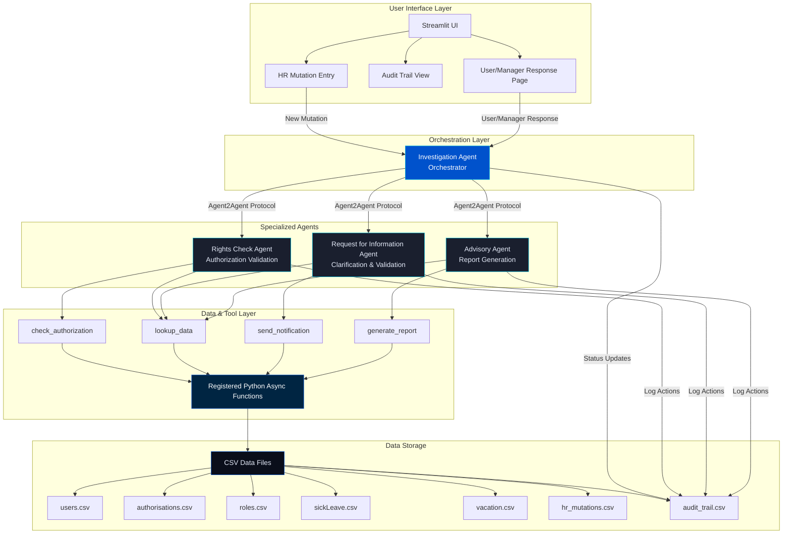
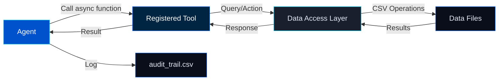
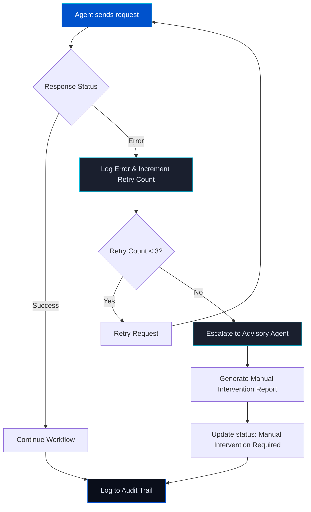
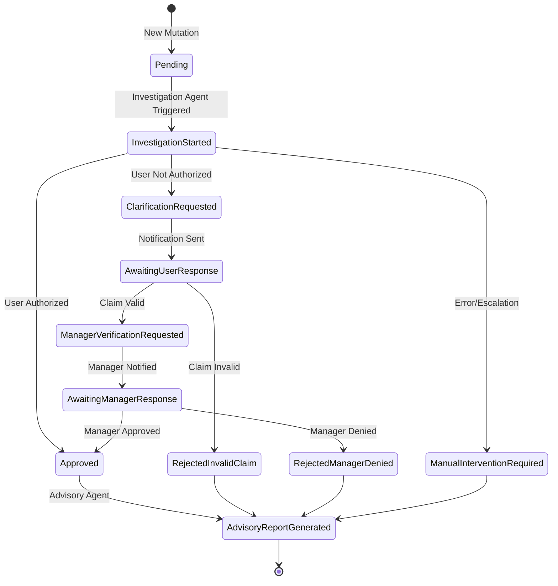

# Multi-Agent System Architecture

## Overview

The Multi-Agent Access Control System uses a specialized agent architecture to automate change investigation and governance. Each agent has a specific role and communicates via the Agent2Agent protocol, with all tool calls implemented as Python async functions registered using the Azure SDK.

---

## Agent Architecture Diagram



---

## Agent Roles & Responsibilities

### 1. Investigation Agent (Orchestrator)
**Purpose:** Orchestrates the entire investigation workflow and coordinates other agents

**Key Responsibilities:**
- Receives new HR mutation triggers from UI
- Maintains investigation context throughout workflow
- Delegates tasks to specialized agents via Agent2Agent protocol
- Updates `change_investigation` status in `hr_mutations.csv`
- Logs all major actions to audit trail
- Manages error handling, retries, and escalation

**Tool Calls:**
- `lookup_data`: Gather context and evidence at investigation start

**Agent2Agent Messages Sent:**
- `check_rights` → RightsCheckAgent
- `request_clarification` → RequestForInformationAgent
- `request_manager_validation` → RequestForInformationAgent
- `generate_advisory_report` → AdvisoryAgent

---

### 2. Rights Check Agent
**Purpose:** Validates user authorization for mutations

**Key Responsibilities:**
- Checks if the changer had correct rights for the action
- Queries authorization data from CSV files
- Returns authorization result with evidence
- Logs all authorization checks

**Tool Calls:**
- `check_authorization`: Validate user rights against system/access level
- `lookup_data`: Gather supporting evidence from authorisations.csv, roles.csv

**Input Context:**
- User ID
- System/Application
- Access level required
- Mutation details

**Output:**
- `authorized`: boolean
- `evidence`: Authorization records
- `message`: Explanation

---

### 3. Request for Information Agent
**Purpose:** Handles clarifications and validations with users and managers

**Key Responsibilities:**
- Contacts changers for clarification (mocked notifications)
- Validates claims against data (e.g., sick leave, vacation)
- Contacts managers for validation
- Processes user/manager responses from UI
- Logs all communication and validation actions

**Tool Calls:**
- `send_notification`: Send (mocked) notifications to users/managers
- `lookup_data`: Validate claims against sickLeave.csv, vacation.csv

**Two Modes:**
1. **User Clarification Mode**
   - Sends clarification request to changer
   - Validates user's claim (e.g., sick leave dates)
   - Returns validation result

2. **Manager Validation Mode**
   - Sends validation request to manager
   - Processes manager's approval/denial
   - Returns manager decision

---

### 4. Advisory Agent
**Purpose:** Generates final advisory reports and recommendations

**Key Responsibilities:**
- Synthesizes all investigation findings
- Generates comprehensive advisory report
- Provides recommendation (accept/reject/manual intervention)
- Logs report generation

**Tool Calls:**
- `generate_report`: Create advisory report with summary and recommendation
- `lookup_data`: Gather additional evidence if needed

**Output Format:**
- `report_id`: Unique report identifier
- `summary`: Executive summary of investigation
- `recommendation`: One of:
  - **Accept**: Change is valid and authorized
  - **Reject/Investigate**: Change requires further investigation
  - **Manual Intervention**: Correct but requires human review
- `details`: Full investigation context and evidence

---

## Agent2Agent Protocol

### Message Schema

All agent-to-agent communication uses this structured format:

```json
{
    "sender": "InvestigationAgent",
    "receiver": "RightsCheckAgent",
    "action": "check_rights",
    "context": {
        "mutation_id": "1001",
        "user_id": "u001",
        "system": "FinanceApp",
        "access_level": "Admin"
    },
    "correlation_id": "corr-abc123",
    "timestamp": "2025-11-10T09:00:00Z",
    "status": "pending"
}
```

### Protocol Fields

| Field | Type | Required | Description |
|-------|------|----------|-------------|
| sender | str | Yes | Name of sending agent |
| receiver | str | Yes | Name of receiving agent |
| action | str | Yes | Action/request type |
| context | dict | Yes | Investigation context, mutation data, findings |
| correlation_id | str | Yes | Unique ID for tracing message flow |
| timestamp | str | Yes | ISO 8601 timestamp |
| status | str | Yes | Message status (pending/success/error) |
| error | dict | No | Error details if status is 'error' |

---

## Workflow Sequence Diagram

```mermaid
sequenceDiagram
    participant UI as Streamlit UI
    participant IA as Investigation Agent
    participant RCA as Rights Check Agent
    participant RIA as Request for Information Agent
    participant AA as Advisory Agent
    participant Tools as Python Async Functions
    participant Data as CSV Files

    Note over UI,Data: New HR Mutation Submitted

    UI->>IA: New mutation event
    activate IA
    IA->>Tools: lookup_data(context)
    Tools->>Data: Query mutation details
    Data-->>Tools: Mutation data
    Tools-->>IA: Context gathered
    
    Note over IA,RCA: Rights Check Phase
    IA->>RCA: check_rights (correlation_id, context)
    activate RCA
    RCA->>Tools: check_authorization(user, system, level)
    Tools->>Data: Query authorisations.csv, roles.csv
    Data-->>Tools: Authorization records
    Tools-->>RCA: Authorization result
    RCA-->>IA: check_rights_result (authorized, evidence)
    deactivate RCA
    
    alt User Authorized
        IA->>Data: Update status to 'Approved'
        IA->>AA: generate_advisory_report
        activate AA
        AA->>Tools: generate_report(mutation_id, context)
        Tools-->>AA: Report generated
        AA-->>IA: advisory_report_result
        deactivate AA
    else User Not Authorized
        Note over IA,RIA: User Clarification Phase
        IA->>RIA: request_clarification (correlation_id, context)
        activate RIA
        RIA->>Tools: send_notification(user, subject, body)
        Tools-->>RIA: Notification sent (mocked)
        RIA->>Data: Update status to 'Awaiting User Response'
        
        UI->>RIA: User response received
        RIA->>Tools: lookup_data(sickLeave.csv / vacation.csv)
        Tools->>Data: Query validation data
        Data-->>Tools: Validation records
        Tools-->>RIA: Claim validation result
        
        alt Claim Valid
            Note over IA,RIA: Manager Validation Phase
            RIA->>Tools: send_notification(manager, subject, body)
            Tools-->>RIA: Notification sent (mocked)
            RIA->>Data: Update status to 'Awaiting Manager Response'
            
            UI->>RIA: Manager response received
            RIA-->>IA: manager_validation_response (approved/denied)
            deactivate RIA
            
            alt Manager Approved
                IA->>Data: Update status to 'Approved'
                IA->>AA: generate_advisory_report
                activate AA
                AA->>Tools: generate_report(mutation_id, context)
                Tools-->>AA: Report generated
                AA-->>IA: advisory_report_result (recommendation: accept)
                deactivate AA
            else Manager Denied
                IA->>Data: Update status to 'Rejected - Manager Denied'
                IA->>AA: generate_advisory_report
                activate AA
                AA->>Tools: generate_report(mutation_id, context)
                Tools-->>AA: Report generated
                AA-->>IA: advisory_report_result (recommendation: reject)
                deactivate AA
            end
            
        else Claim Invalid
            RIA-->>IA: clarification_response (claim_invalid)
            deactivate RIA
            IA->>Data: Update status to 'Rejected - Invalid User Claim'
            IA->>AA: generate_advisory_report
            activate AA
            AA->>Tools: generate_report(mutation_id, context)
            Tools-->>AA: Report generated
            AA-->>IA: advisory_report_result (recommendation: reject)
            deactivate AA
        end
    end
    
    IA->>Data: Log to audit_trail.csv
    IA->>UI: Update UI with final status
    deactivate IA
```

---

## Tool Call Architecture

### Registered Python Async Functions

All agent tool calls are implemented as Python async functions registered with the agent using the Azure AI SDK. There is no REST MCP server.

| Function Name | Purpose | Used By |
|--------------|---------|---------|
| check_authorization | Validate user rights | RightsCheckAgent |
| lookup_data | Query CSV data files | All Agents |
| send_notification | Send mocked notifications | RequestForInformationAgent |
| generate_report | Generate advisory report | AdvisoryAgent |

### Tool Call Flow



---

## Error Handling & Retry Logic



---

## Status Flow Diagram



---

## Agent Communication Matrix

| From Agent | To Agent | Action | Purpose |
|------------|----------|--------|---------|
| Investigation | Rights Check | check_rights | Validate user authorization |
| Investigation | Request for Info | request_clarification | Get user explanation |
| Investigation | Request for Info | request_manager_validation | Get manager approval |
| Investigation | Advisory | generate_advisory_report | Create final report |
| Rights Check | Investigation | check_rights_result | Return authorization result |
| Request for Info | Investigation | clarification_response | Return user response validation |
| Request for Info | Investigation | manager_validation_response | Return manager decision |
| Advisory | Investigation | advisory_report_result | Return final report and recommendation |

---

## Data Dependencies

### Investigation Agent
- **Reads:** hr_mutations.csv, audit_trail.csv
- **Writes:** hr_mutations.csv (status updates), audit_trail.csv

### Rights Check Agent
- **Reads:** users.csv, authorisations.csv, roles.csv, role_authorisations.csv
- **Writes:** audit_trail.csv

### Request for Information Agent
- **Reads:** users.csv, sickLeave.csv, vacation.csv, hr_mutations.csv
- **Writes:** audit_trail.csv, pending_actions.csv (mocked notifications)

### Advisory Agent
- **Reads:** hr_mutations.csv, audit_trail.csv (for investigation context)
- **Writes:** audit_trail.csv

---

## Implementation Pattern

All agents follow this standard pattern:

```python
from azure.ai.projects import AIProjectClient
from azure.identity import DefaultAzureCredential

class AgentName:
    def __init__(self, config):
        self.config = config
        self.project_client = AIProjectClient(
            endpoint=config['PROJECT_ENDPOINT'],
            credential=DefaultAzureCredential()
        )
    
    def handle_request(self, context: dict) -> dict:
        """
        Main entry point for agent processing
        
        Args:
            context: Dict with mutation details, user info, prior findings
            
        Returns:
            Dict with status, results, and updates for audit trail
        """
        # 1. Call Azure model for reasoning
        prompt = self._build_prompt(context)
        response = self.project_client.completions.create(
            deployment=config['MODEL_DEPLOYMENT'],
            prompt=prompt,
            max_tokens=256
        )
        
        # 2. Call registered tool functions as needed
        tool_result = await self._call_tool(context)
        
        # 3. Process results and update context
        result = self._process_response(response, tool_result)
        
        # 4. Log to audit trail
        self._log_action(context, result)
        
        return result
```

---

## Key Design Principles

1. **Modularity**: Each agent has a single, well-defined responsibility
2. **Traceability**: All actions logged to audit trail with correlation IDs
3. **Protocol-Based Communication**: Agent2Agent protocol ensures consistent message format
4. **Tool Call Abstraction**: All data access and external actions via registered Python async functions
5. **Local Orchestration**: No persistent agent registration; all orchestration is local Python
6. **Auditability**: Full reconstruction of investigation flow from audit trail
7. **Error Handling**: Retry logic with escalation to manual intervention
8. **Mocked Notifications**: All user/manager communication simulated in UI for demo/testing

---

## References

- [architecture.md](architecture.md): Full technical architecture and protocol details
- [application.md](application.md): Application overview and user stories
- [flow.md](flow.md): Canonical workflow diagram
- [toolcalls.md](toolcalls.md): Tool call specifications and examples
- [csv_schemas.md](csv_schemas.md): Data model and CSV schemas
- [agent_protocol.py](../src/agent_protocol.py): Agent2Agent protocol implementation

---

*Generated: November 10, 2025*
