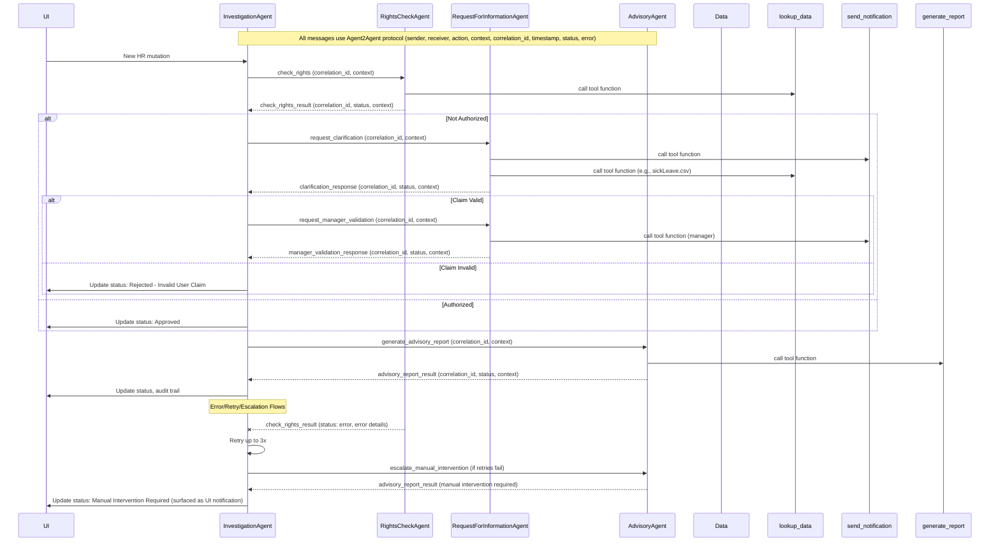
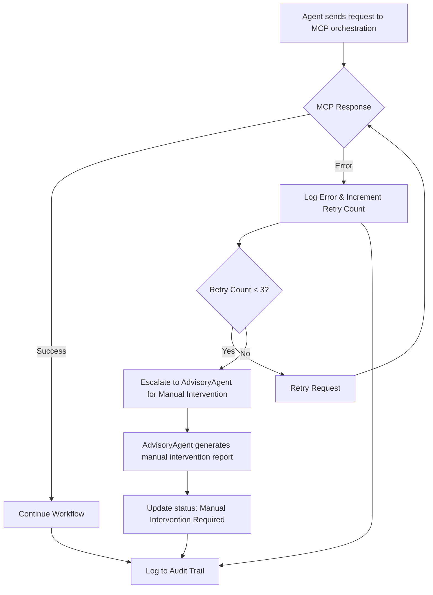
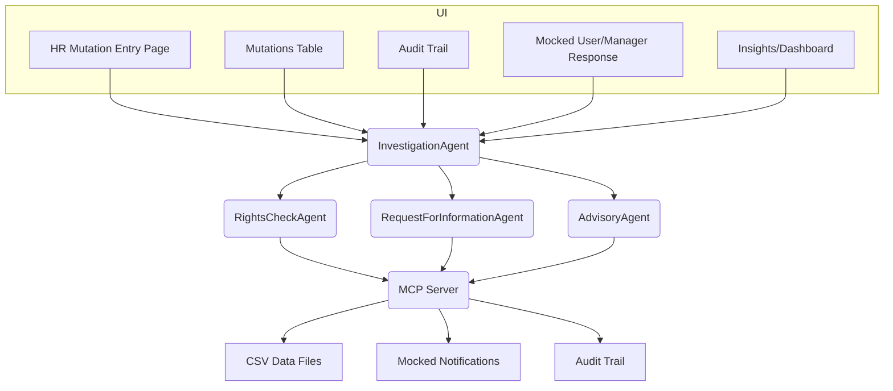

# See Also
- [application.md](application.md): Onboarding, environment setup, deployment instructions, contributor guidance
- [flow.md](flow.md): Canonical workflow diagram
- [wireframe.md](wireframe.md): UI wireframes and layouts
- [toolcalls.md](toolcalls.md): MCP tool call protocol and agent tool call details
- [csv_schemas.md](csv_schemas.md): Canonical CSV schemas and data model
- [CONTRIBUTING.md](CONTRIBUTING.md): Developer onboarding and contribution process
- [README.md](README.md): Documentation index and onboarding

This document focuses on technical architecture, agent implementation, protocol, workflow, and audit/compliance details.


# Agent Tool Call Sequences (Explicit Mapping)

# Agent Tool Call Details by Agent

## Canonical Tool Calls (see toolcalls.md for full specification)

The following tool calls are registered as Python async functions and used by agents for all workflow steps. For full details, see [`toolcalls.md`](toolcalls.md).

| Function Name         | Purpose                        | Input Args (required)                | Output Fields                  |
|----------------------|-------------------------------|--------------------------------------|-------------------------------|
| check_authorization  | Check user authorization       | user_id, system, access_level        | authorized, evidence, message |
| lookup_data          | Query data from CSV files      | file, query (dict of filters)        | results, message              |
| send_notification    | Send (mocked) notification     | recipient_id, subject, body, context | status, message_id, message   |
| generate_report      | Generate advisory report       | mutation_id, context                 | report_id, summary, recommendation, details |

All tool calls and their results are logged to the audit trail for traceability.

**Note:** All agent tool calls are performed as Python async functions registered with the agent using the Azure AI SDK. The MCP server is implemented as a local Python orchestration pattern (not a REST API). All orchestration, message passing, and workflow logic is handled locally in Python, following the pattern in `src/old/agent_example.py`. All notifications and agent-to-user/manager communication are mocked and surfaced as UI pages (not real emails).

The following table provides a detailed mapping for each agent, including:
- The tool calls it makes (as registered Python async functions)
- The order/conditions for each call
- What data is passed to the Azure model for reasoning


| Agent                        | Tool Call(s) (Function Name)         | Order/Condition                                                                 | Data Passed to Azure Model for Reasoning |
|------------------------------|--------------------------------------|---------------------------------------------------------------------------------|-----------------------------------------|
| InvestigationAgent           | `lookup_data` (Python async function)                        | At investigation start, if additional context/evidence is needed                 | Full investigation context, mutation details, prior findings                   |
| RightsCheckAgent             | `check_authorization`, `lookup_data` (Python async functions) | On rights check request<br>Optionally for supporting evidence                  | User ID, mutation details, system, access level, context                       |
| RequestForInformationAgent   | `send_notification`, `lookup_data` (Python async functions)   | On clarification/validation request<br>To validate claims (e.g., sick leave)    | Mutation context, clarification questions, user/manager info, claim details    |
| AdvisoryAgent                | `generate_report`, `lookup_data` (Python async functions)     | On advisory report request<br>Optionally for additional evidence               | Full investigation context, findings from other agents                         |

**Order/Conditions Explained:**
- Agents only call endpoints as needed for their responsibilities and workflow step.
- Data lookup is used for context/evidence gathering; authorization check is for rights validation; notify/send is for clarification/validation; report/generate is for final advisory.

**Data Passed to Azure Model:**
- Each agent passes the full relevant context for its reasoning step, including mutation details, user/manager info, prior findings, and any evidence gathered from tool calls.


See the next section for how user/manager responses are surfaced to RequestForInformationAgent.

---

## How User/Manager Responses Are Surfaced to RequestForInformationAgent

When the `RequestForInformationAgent` sends a clarification or validation request (via a tool call), the system enters a waiting state for a user or manager response. This is handled as follows:

- The UI (see wireframes in `docs/wireframe.md`) displays a notification or form to the relevant user/manager, allowing them to provide a response directly in the application (simulating an email/inbox).
- The response is captured by the UI and routed back to the backend, where it is logged and made available to the `RequestForInformationAgent` for further processing.
- All such interactions are logged in the audit trail for traceability.
- The agent then continues its workflow, validating the response (e.g., by calling the appropriate tool function for sick leave or vacation validation) and returning findings to the orchestrator.

**UI/Backend Flow:**
1. Agent calls the registered Python async notification function (RequestForInformationAgent → MCP orchestration → UI mock)
2. UI displays a response form to the user/manager
3. User/manager submits response in the UI
4. Backend logs the response and updates the investigation context
5. Agent processes the response and continues workflow

See the UI wireframes and audit trail documentation for more details.

---

## UI Wireframes and Documentation Alignment

The UI wireframes and documentation in [`docs/wireframe.md`](wireframe.md) are designed to match the agent tool call flow described above. Key points:

- The HR Mutation Entry Page, Audit Trail Page, and Mocked User/Manager Response Page directly support the agent workflow and tool call sequence.
- When the system is awaiting a user or manager response (triggered by `/api/notify/send`), the UI presents a form for the relevant party to respond, as described in the wireframes.
- All agent actions, tool calls, and user/manager responses are logged and surfaced in the UI for full traceability.
- The UI supports all workflow states and status codes as described in the documentation and sequence diagrams.

**Reference:**
- See [`docs/wireframe.md`](wireframe.md) for canonical UI layouts and response flows.
- See the sequence diagram and tool call mapping above for how UI states correspond to agent tool calls and workflow steps.
This section provides an explicit, step-by-step mapping of tool calls for each agent, as implemented via the MCP server (Model Context Protocol). For the full MCP tool call protocol specification, see [`toolcalls.md`](toolcalls.md). This ensures clarity on agent responsibilities and supports both development and auditability.
## Agent Tool Call Summary Table
| Agent                        | Tool Call(s) (Registered Python Async Function)           | Sequence/When Used                                 |
|------------------------------|----------------------------------------------------------|----------------------------------------------------|
| InvestigationAgent           | lookup_data                                              | At investigation start, to gather context          |
| RightsCheckAgent             | check_authorization, lookup_data                         | On rights check request                            |
| RequestForInformationAgent   | send_notification, lookup_data                           | On clarification/validation request                |
| AdvisoryAgent                | generate_report, lookup_data                             | On advisory report request                         |
## Step-by-Step Tool Call Sequences
### InvestigationAgent
1. Receives new HR mutation context.
2. (If needed) Calls `lookup_data` registered tool function to gather additional context or evidence.
3. Delegates rights check to RightsCheckAgent via Agent2Agent protocol.
4. Delegates clarification/validation to RequestForInformationAgent as needed.
5. Delegates report generation to AdvisoryAgent at end of workflow.
6. Logs all actions and status changes.
### RightsCheckAgent
1. Receives context from InvestigationAgent.
2. Calls `check_authorization` registered tool function to validate user rights.
3. (Optional) Calls `lookup_data` for supporting evidence.
4. Returns result and evidence to InvestigationAgent.
5. Logs all actions and results.
### RequestForInformationAgent
1. Receives clarification or validation request from InvestigationAgent.
2. Calls `send_notification` registered tool function to contact user/manager.
3. Calls `lookup_data` to validate claims (e.g., sick leave, vacation).
4. Handles and logs responses.
5. Returns findings to InvestigationAgent.
### AdvisoryAgent
1. Receives full investigation context from InvestigationAgent.
2. Calls `generate_report` registered tool function to generate advisory report.
3. (Optional) Calls `lookup_data` for additional evidence.
4. Returns report and recommendation to InvestigationAgent.
5. Logs all actions and results.

# Sequence Diagram: Multi-Agent Workflow (Azure SDK Pattern)

See `docs/visualFlowchart.mmd` for the canonical workflow diagram.

Below is a detailed sequence diagram for agent-to-agent message flows, including protocol fields, correlation IDs, timestamps, and error/retry/escalation flows, using the Azure SDK-based orchestration and registered Python async tool functions:



Update this diagram as the workflow or agent interactions change.
# Example: Minimal Agent Using Azure Model

```python
from azure.ai.projects import AIProjectClient
from azure.identity import DefaultAzureCredential
import os
from dotenv import load_dotenv

# Load environment variables
load_dotenv(dotenv_path=os.path.join(os.path.dirname(__file__), '../src/.env'))
PROJECT_ENDPOINT = os.getenv('PROJECT_ENDPOINT')
MODEL_DEPLOYMENT = os.getenv('AGENT_MODEL_DEPLOYMENT_NAME')

project_client = AIProjectClient(
    endpoint=PROJECT_ENDPOINT,
    credential=DefaultAzureCredential(),
)

class InvestigationAgent:
    def handle_request(self, context):
        # Compose prompt from context
        prompt = f"Investigate mutation: {context['mutation_id']}"
        # Call Azure model
        response = project_client.completions.create(
            deployment=MODEL_DEPLOYMENT,
            prompt=prompt,
            max_tokens=256
        )
        return {'result': response.choices[0].text}
```


This pattern should be used for all agents: local class, Azure model call, no persistent agent registration. All tool calls are registered as Python async functions with the agent using the Azure AI SDK, following the pattern in `src/old/agent_example.py`.


# Agent Implementation Pattern: Local Class, Azure Model Inference, Registered Tool Functions

All agents must be implemented as local Python classes with a `handle_request(context)` method. This method should call an Azure-hosted model for reasoning/decision-making, using the Azure AI SDK and credentials from `.env`. All tool calls (data lookup, authorization, notification, report generation) are implemented as Python async functions and registered with the agent using the Azure SDK. See `src/old/agent_example.py` and `/examples/agent_usage_example.py` for reference.

**Key points:**
- Agents are not registered or orchestrated as persistent Azure resources. All orchestration, message passing, and workflow logic is handled locally in Python.
- Use the structure and best practices from `src/old/agent_example.py` as a template for model calls and tool integration.
- All tool calls are Python async functions registered with the agent (not REST endpoints).
- All tool calls and results must be logged for audit (see audit trail documentation).
- Error, retry, and escalation flows are handled locally in the orchestrator (see `agent_main.py`).
- The Agent2Agent protocol and canonical message schema are defined in `src/agent_protocol.py`.

This pattern is illustrated in `src/old/agent_example.py` and should be followed for all agent implementations. See `flow.md` for the canonical workflow.

---

## Error, Retry, and Escalation Flows (Example)

The following diagram illustrates how errors, retries, and escalation to manual intervention are handled in the agent workflow (all requests are local Python function calls, not HTTP requests):



**Notes:**
- All errors are logged with details (status, error code, message, correlation ID).
- The orchestrator retries failed requests up to 3 times before escalating.
- Escalation triggers the AdvisoryAgent to generate a manual intervention report, and the status is updated accordingly.
- All actions and status changes are logged in the audit trail for traceability.

---

# High-Level System Architecture Diagram



---

# Detailed Workflow Flowchart

For the full, step-by-step workflow diagram (including all status transitions, agent triggers, and audit trail logging), see [`docs/visualFlowchart.mmd`](visualFlowchart.mmd). This is the canonical source for the detailed process flow and matches the workflow described in `application.md`.

> **Note:** Keeping the flowchart in a single `.mmd` file ensures a single source of truth and avoids duplication. Please update `visualFlowchart.mmd` if the workflow changes.

You can view or edit the diagram directly in Mermaid-compatible editors or VS Code extensions.

---

---

# Core Modules and Responsibilities

| Module/File                | Responsibility                                                      |
|---------------------------|---------------------------------------------------------------------|
| [`src/agent_main.py`](../src/agent_main.py)       | Orchestrates workflow, agent registration, message routing           |
| [`src/InvestigationAgent.py`](../src/InvestigationAgent.py) | Local agent class; calls Azure model for investigation logic        |
| [`src/RightsCheckAgent.py`](../src/RightsCheckAgent.py) | Local agent class; calls Azure model for rights checking             |
| [`src/RequestForInformationAgent.py`](../src/RequestForInformationAgent.py) | Local agent class; calls Azure model for clarifications, manager validation |
| [`src/AdvisoryAgent.py`](../src/AdvisoryAgent.py)    | Local agent class; calls Azure model for advisory/report generation  |
| [`src/agent_protocol.py`](../src/agent_protocol.py)   | Defines Agent2Agent protocol, message schema, logging                |
| [`src/mcp_server.py`](../src/mcp_server.py)       | (Legacy) Implements MCP server API, tool call endpoints, audit logging. Deprecated; not used in Azure SDK-based pattern.        |
| [`src/ui.py`](../src/ui.py)               | Streamlit UI entrypoint, navigation, page rendering                  |
| [`data/*.csv`](../data/)              | Data storage: users, roles, authorisations, mutations, audit trail   |
| [`docs/architecture.md`](architecture.md)    | Architecture documentation, diagrams, protocol, API docs             |
| [`docs/application.md`](application.md)     | Application overview, user stories, acceptance criteria, onboarding   |
| [`docs/CONTRIBUTING.md`](CONTRIBUTING.md)    | Contributor onboarding, quickstart, workflow                         |
| [`docs/csv_schemas.md`](csv_schemas.md)     | Canonical CSV schemas, sample data                                   |
| [`docs/prompts.md`](prompts.md)         | Prompt templates, best practices for agentic coding                  |

---
---

## Agent Class Interfaces

Each agent is implemented as a Python class with a standard interface. The main method is `handle_request(context: dict) -> dict`, which processes the incoming request and returns a result dict.

### Context Object
- The `context` parameter is a Python dict containing all relevant data for the agent's task (e.g., mutation details, user info, prior findings).
- The result dict should include status, findings, errors, and any updates for the audit trail.

### Minimal Code Templates

#### InvestigationAgent
```python
class InvestigationAgent:
    def __init__(self, config):
        self.config = config  # environment/configuration

    def handle_request(self, context: dict) -> dict:
        # Orchestrate investigation workflow
        # Call other agents via Agent2Agent protocol
        # Update audit trail
        return {"status": "success", "action": "investigation_complete", "details": {}}
```

#### RightsCheckAgent
```python
class RightsCheckAgent:
    def __init__(self, mcp_client):
        self.mcp_client = mcp_client

    def handle_request(self, context: dict) -> dict:
        # Call MCP server to check authorizations
        # Return result and evidence
        return {"status": "success", "authorized": True, "evidence": {}}
```

#### RequestForInformationAgent
```python
class RequestForInformationAgent:
    def __init__(self, mcp_client):
        self.mcp_client = mcp_client

    def handle_request(self, context: dict) -> dict:
        # Send notification, validate claims, handle responses
        return {"status": "success", "response": "clarification received", "details": {}}
```

#### AdvisoryAgent
```python
class AdvisoryAgent:
    def __init__(self, mcp_client):
        self.mcp_client = mcp_client

    def handle_request(self, context: dict) -> dict:
        # Generate advisory report and recommendation
        return {"status": "success", "report": {}, "recommendation": "accept"}
```

- Each agent is instantiated with required configuration or MCP client.
- The orchestrator (main workflow) calls `handle_request(context)` for each agent as needed.
- All agent actions and results are logged for auditability.
# Multi-Agent Access Control Architecture

## Introduction & Scope
This document describes the architecture for the Access Control Management System, which uses a multi-agent AI approach to automate, investigate, and advise on changes in business systems. The architecture covers agent roles, agent communication (Agent2Agent protocol), tool call usage, and the mapping between system workflow and implementation targets.

The scope includes:
- Multi-agent orchestration for change investigation and governance
- Agent2Agent protocol for agent communication and context passing
- Tool call integration for agent actions (e.g., data lookups, notifications)
- Data and UI foundation for traceability and user interaction

---


## Multi-Agent System Overview

The system is composed of specialized agents, each responsible for a distinct part of the change investigation and advisory process. The Investigation Agent orchestrates the flow, calling other agents as needed and updating the audit trail. All tool calls (e.g., data lookups, notifications, validations) are performed via a central MCP (Model Context Protocol) server, which acts as the execution and integration layer for agent actions.

---

## Agent Implementation Details

Each agent is implemented as a Python class/module with a standard interface (e.g., `handle_request(context)`). All agent-to-agent communication uses the Agent2Agent protocol and message schema (see `src/agent_protocol.py`). All tool calls are routed through the MCP server and are fully logged for auditability. The canonical workflow diagrams are maintained in `docs/visualFlowchart.mmd` and should be updated as the workflow changes. UI wireframes are kept in `docs/wireframe.md` and should be kept up to date with the actual UI. Error/retry/escalation flows and audit logging policy are implemented as described in this document and tracked in `TODO.md`.

---
### Agents and Responsibilities

- **Investigation Agent**: Orchestrates the investigation, maintains context, updates audit status, and coordinates other agents via Agent2Agent protocol.
- **Rights Check Agent**: Checks if the user who made a change had the correct rights, using tool calls to query authorizations.
- **Request for Information Agent**: Contacts the changer for clarification and validates their response (e.g., with sick leave data); also contacts the manager for validation of the changer’s claim.
- **Advisory Agent**: Generates a detailed advisory report and recommendation for the Change Controller, based on all gathered context.

All agent-to-agent communication is handled via the Agent2Agent protocol, ensuring modularity, traceability, and clear context passing.

---


## Agent2Agent Protocol

The Agent2Agent protocol is a structured messaging and context-passing mechanism that allows agents to:
- Send requests and receive responses asynchronously
- Pass investigation context, status, and findings
- Log all interactions for auditability

This protocol ensures modularity, traceability, and robust agent orchestration. All agent-to-agent messages are Python dicts (or JSON objects) with a formal schema (see below).

## Agent2Agent Protocol Message Schema (Quick Reference)

All agent-to-agent communication uses the following structured message schema for traceability, modularity, and auditability.

| Field          | Type      | Required | Description                                      |
|--------------- |---------- |----------|--------------------------------------------------|
| sender         | str       | Yes      | Name of sending agent                            |
| receiver       | str       | Yes      | Name of receiving agent                          |
| action         | str       | Yes      | Action/request type (e.g., 'check_rights')       |
| context        | dict      | Yes      | Investigation context, mutation data, findings    |
| correlation_id | str       | Yes      | Unique ID for tracing message flow               |
| timestamp      | str       | Yes      | ISO 8601 timestamp of message                    |
| status         | str       | Yes      | Message status (e.g., 'pending', 'success', 'error') |
| error          | dict      | No       | Error details if status is 'error'               |

#### Example Message (Rights Check Request)
```json
{
    "sender": "InvestigationAgent",
    "receiver": "RightsCheckAgent",
    "action": "check_rights",
    "context": {
        "mutation_id": "1001",
        "user_id": "u001",
        "system": "FinanceApp",
        "access_level": "Admin"
    },
    "correlation_id": "corr-abc123",
    "timestamp": "2025-10-23T09:00:00Z",
    "status": "pending"
}
```

#### Example Message (Rights Check Response)
```json
{
    "sender": "RightsCheckAgent",
    "receiver": "InvestigationAgent",
    "action": "check_rights_result",
    "context": {
        "authorized": true,
        "evidence": {"authorisation_id": "A001", "role_id": "R001"},
        "message": "User u001 is authorized as Admin for FinanceApp."
    },
    "correlation_id": "corr-abc123",
    "timestamp": "2025-10-23T09:00:01Z",
    "status": "success"
}
```

#### Example Message (Error)
```json
{
    "sender": "RightsCheckAgent",
    "receiver": "InvestigationAgent",
    "action": "check_rights_result",
    "context": {},
    "correlation_id": "corr-abc123",
    "timestamp": "2025-10-23T09:00:01Z",
    "status": "error",
    "error": {
        "code": 404,
        "message": "User not found"
    }
}
```

...existing code...

### Error Handling & Retry Flows

- If an agent fails to respond or returns an error, the orchestrator retries the request up to N times (default: 3).
- After N failures, the orchestrator logs the error, updates the audit trail, and escalates to manual intervention or the Advisory Agent.
- All errors, retries, and escalations are logged for auditability.

### Example Messages for Each Agent Interaction

**InvestigationAgent → RightsCheckAgent**
- Action: 'check_rights'
- Context: mutation details

**RightsCheckAgent → InvestigationAgent**
- Action: 'check_rights_result'
- Context: authorization result

**InvestigationAgent → RequestForInformationAgent**
- Action: 'request_clarification' or 'request_manager_validation'
- Context: mutation details, user/manager info

**RequestForInformationAgent → InvestigationAgent**
- Action: 'clarification_response' or 'manager_validation_response'
- Context: user/manager response, validation result

**InvestigationAgent → AdvisoryAgent**
- Action: 'generate_advisory_report'
- Context: full investigation findings

**AdvisoryAgent → InvestigationAgent**
- Action: 'advisory_report_result'
- Context: report summary, recommendation

All messages must include correlation_id and timestamp for traceability. All interactions are logged in the audit trail.

---


## Tool Calls, MCP Server, and Agent Actions

Agents do not execute tool calls directly. Instead, all tool calls are routed through the MCP server, which provides a unified interface for:
- Querying authorization data (for Rights Check Agent)
- Sending (mocked) notifications or emails (for Request for Information Agent)
- Validating claims with external data (e.g., sick leave)
- Generating and sending reports (for Advisory Agent)

The MCP server abstracts and centralizes all integrations, so agents remain modular and the system can be extended or modified without changing agent logic.

---


## MCP Server: Architectural Role & Responsibilities


The MCP (Model Context Protocol) server is a core component that exposes all tool calls required by agents, handles data access, notifications, and report generation, and logs all tool call requests and results for auditability. For full contract, function signatures, and example requests/responses, see [`toolcalls.md`](toolcalls.md).

...existing code...

---

## Data & UI Foundation

- All data is stored in CSV files (e.g., `authorisations.csv`, `hr_mutations.csv`, `role_authorisations.csv`, `roles.csv`, `users.csv`, `sickLeave.csv`, `vacation.csv`).

For complete and canonical CSV schema definitions, including columns, types, constraints, and sample rows for all data files, see [`csv_schemas.md`](csv_schemas.md). This file is the single source of truth for all data model details and should be referenced for onboarding, validation, and development.
- The UI (e.g., Streamlit) provides:
    - An HR mutation entry page (with dropdowns for users, applications, and reason field)
    - A chat/trigger page for interacting with and triggering the system
    - An insights page for investigation status, metrics, anomalies, and audit trails
- Audit trails are maintained for all agent actions and every status change in the investigation process. Every update to the status in the Audit/change_investigation column of hr_mutations.csv must be logged for full traceability.

---

## Workflow Mapping

The following table maps the system workflow and user stories (see `application.md`) to the agent architecture:

| Step | Agent(s) Involved | Description |
|------|-------------------|-------------|
| 1    | System, Investigation Agent | New HR mutation triggers investigation |
| 2    | Rights Check Agent, Investigation Agent | Rights are checked; if authorized, Investigation Agent updates `change_investigation` to 'Approved' |
| 3    | Request for Information Agent, Investigation Agent | Changer is contacted for clarification; claim validated (e.g., sick leave, vacation) |
| 4    | Request for Information Agent, Investigation Agent | Manager is contacted for validation |
| 5    | Advisory Agent, Investigation Agent | Advisory report is generated and sent with outcome: accept, reject/investigate, or manual intervention |

---

## Architecture Flow Diagram

Below is a simplified flow diagram of the multi-agent system:

```
User/Changer
    |
    v
HR Mutation Entry Page (UI)
    |
    v
Investigation Agent (orchestrator)
    |
    +--> Rights Check Agent (tool call: check rights)
    |
    +--> Request for Information Agent (tool call: contact changer, validate (e.g., sick leave, vacation), contact manager)
    |
    +--> Advisory Agent (tool call: generate/send report with outcome: accept, reject/investigate, or manual intervention)
    |
    v
Audit Trail & Insights Page
```

All agent-to-agent communication is via the Agent2Agent protocol, and all actions are logged for auditability.

---

## Front-End/UI Requirements

To support the agentic workflow, auditability, and demo/testability, the system must provide a user interface with the following features:

### 1. HR Mutation Entry Page
- Form for creating new HR mutations (dropdowns for user, application, reason, etc.).
- Triggers the Investigation Agent and starts the workflow.

### 2. HR Mutations Table
- Table view of all HR mutations with their current status (`change_investigation`).
- Supports filtering, sorting, and selection for further inspection.

### 3. Audit Trail Page
- For a selected mutation, displays the full audit trail: agent actions, status changes, timestamps.
- Enables step-by-step tracking of the investigation process.

### 4. Mocked User/Manager Response Page
- When the system is awaiting a user or manager response (e.g., `Awaiting User Response`, `Awaiting Manager Response`), the UI presents a form or button for a human to provide a mock response.
- This simulates email/notification interactions and allows the workflow to proceed without real email integration.
- All such interactions are logged in the audit trail for traceability.

### 5. Insights/Dashboard Page (Recommended)
- Shows metrics, status counts, anomalies, and investigation timelines.
- Useful for compliance, monitoring, and demonstration.

### 6. (Optional) Manual Trigger/Chat Page
- Allows manual triggering of agents or direct interaction for testing and debugging.

#### Mocking Email/Notification Interactions
- All agent requests for clarification or validation are surfaced in the UI, allowing a human to provide a response directly.
- No real email integration is required; all communication is handled via the UI and logged for auditability.


---

## UI Wireframes and Screenshots

The canonical UI wireframes for all main pages are maintained in [`docs/wireframe.md`](wireframe.md). These text-based wireframes describe the layout, navigation, and key elements for:
- HR Mutation Entry Page
- HR Mutations Table
- Audit Trail Page
- Mocked User/Manager Response Page
- Insights/Dashboard Page
- (Optional) Manual Trigger/Chat Page

Refer to `wireframe.md` for the latest UI structure and layout. As the UI evolves, graphical screenshots or mockups can be added to this section or to `wireframe.md`.

---

This UI design ensures the system is fully testable, auditable, and suitable for demonstration, while supporting all workflow and compliance requirements.

This architecture enables modular, auditable, and extensible change governance using a multi-agent system. Each agent is responsible for a clear part of the workflow, and the Agent2Agent protocol ensures robust communication and traceability. The design supports rapid development, easy testing/mocking, and future expansion.

---

## Architectural Decisions & Rationale

- **Python as the main language:** Chosen for rapid prototyping, strong AI/ML ecosystem, and compatibility with Azure AI SDKs.
- **Streamlit for UI:** Enables fast, interactive web UI development in Python, ideal for demos and internal tools.
- **Azure AI Agents/Projects SDK:** Used for agent orchestration, leveraging cloud-based AI and secure integration with Azure resources.
- **MCP (Model Context Protocol) Server:** Centralizes all tool calls, data access, and notifications, ensuring modularity, auditability, and easy mocking/testing.
- **CSV files for data:** Chosen for simplicity, transparency, and ease of manipulation in a demo/prototype context.
- **Agent2Agent protocol:** Ensures modular, auditable, and extensible agent communication.
- **Mocked notifications:** All email/notification flows are simulated in the UI for demo/testability.

## Assumptions & Extensibility Guidelines


---

## Security & Compliance Considerations

- **Sensitive Data Handling:**
    - All access control and HR data is stored in CSV files with strict access permissions.
    - Agents and the MCP server never access data directly; all access is mediated and logged.
    - Audit logs (`audit_trail.csv`) are protected and only accessible to authorized users.
- **Audit Log Protection:**
    - Every agent action and tool call is logged with timestamp, correlation ID, and status.
    - Audit logs are immutable and regularly backed up.
    - Access to audit logs is monitored and restricted.
- **Compliance Requirements:**
    - The system is designed for full traceability and explainability (auditability).
    - Data retention and deletion policies must comply with GDPR and other relevant regulations.
    - All user/manager responses and notifications are mocked for demo/testing; no real personal data is transmitted externally.
    - For production, replace CSVs with a secure database and implement real authentication/authorization.
- The UI is designed for demo/testability: all notifications and user/manager responses are mocked in the UI, not sent via real email or messaging systems.
- Every agent action and status change is logged in `audit_trail.csv` for full auditability and compliance.
- The Agent2Agent protocol and MCP server enforce modularity and separation of concerns; agents never access data or other agents directly.
- The project is structured for easy onboarding and handover, with all setup, environment, and workflow steps documented in `/docs/`.
- The UI supports filtering, sorting, and step-by-step audit trail navigation for transparency and usability.
- The UI must support all workflow states and status codes as described in the documentation.
- The data access layer uses pandas for CSV manipulation.
- The environment is managed with `python-dotenv` and a `.env` file in `/src/`.
- The main entry point for orchestration is `/src/agent_main.py`.
- All required packages are listed in `agentsetup.md` and must be installed for the system to function.

---


## MCP Server API Specification

The MCP (Model Context Protocol) server is the central integration and execution layer for all agent tool calls. All agent actions (data lookups, notifications, validations, report generation) are routed through the MCP server.

### API Endpoints Summary

| Endpoint                      | Method | Purpose                        | Input Args (required)                | Output Fields                  | Error Codes |
|-------------------------------|--------|-------------------------------|--------------------------------------|-------------------------------|-------------|
| /api/authorization/check      | POST   | Check user authorization       | user_id, system, access_level        | authorized, evidence, message | 400,404,500 |
| /api/data/lookup              | POST   | Query data from CSV files      | file, query (dict of filters)        | results, message              | 400,404,500 |
| /api/notify/send              | POST   | Send (mocked) notification     | recipient_id, subject, body, context | status, message_id, message   | 400,404,500 |
| /api/report/generate          | POST   | Generate advisory report       | mutation_id, context                 | report_id, summary, recommendation, details | 400,404,500 |

#### Endpoint Details

**/api/authorization/check**
- Input: user_id (str), system (str), access_level (str)
- Output: authorized (bool), evidence (object), message (str)
- Errors: 400 (bad input), 404 (not found), 500 (internal)

**/api/data/lookup**
- Input: file (str), query (dict)
- Output: results (list of dicts), message (str)
- Errors: 400, 404, 500

**/api/notify/send**
- Input: recipient_id (str), subject (str), body (str), context (dict, optional)
- Output: status (str), message_id (str), message (str)
- Errors: 400, 404, 500

**/api/report/generate**
- Input: mutation_id (str), context (dict)
- Output: report_id (str), summary (str), recommendation (str), details (dict)
- Errors: 400, 404, 500


### Audit Logging Policy

Every API call and result is logged to `audit_trail.csv` with:
- Timestamp
- Endpoint/method
- Input arguments
- Output/result
- Status (success/error)
- Correlation ID (if provided)

This ensures full traceability and compliance for all agent actions. All tool calls must be auditable and reconstructable from the audit trail.

---

## Tool Call Definitions


Agents interact with the MCP server exclusively for all tool calls. For detailed tool call definitions, arguments, expected results, error handling, and mapping to agent responsibilities and workflow steps, see [`toolcalls.md`](toolcalls.md).

---

## Audit Logging Policy and Mechanism

- **All agent actions** (including every major step and error) are logged to `audit_trail.csv` via the `log_agent_message()` function in `agent_protocol.py`.
- **All UI actions** that mutate state (e.g., HR mutation creation, status changes) are logged to `audit_trail.csv` via a dedicated logging helper in `ui.py`.
- **All MCP server tool calls and results** are logged to `audit_trail.csv` via the `log_audit()` function in `mcp_server.py`.
- **Agents do not directly mutate state files** (such as `hr_mutations.csv`). All state changes are orchestrated via the UI or MCP server, which are responsible for logging.
- **No agent method or helper function** should directly write to or mutate data files without a corresponding audit log entry.
- **Log rotation/archiving** is implemented: if `audit_trail.csv` exceeds 1MB, it is archived and a new file is created.
- **Audit trail reconstruction**: The function `get_audit_trail_for_mutation(mutation_id)` in `data_access.py` allows full traceability for any mutation.

This policy ensures that every state change and agent action is auditable, traceable, and compliant with best practices for security and compliance.
