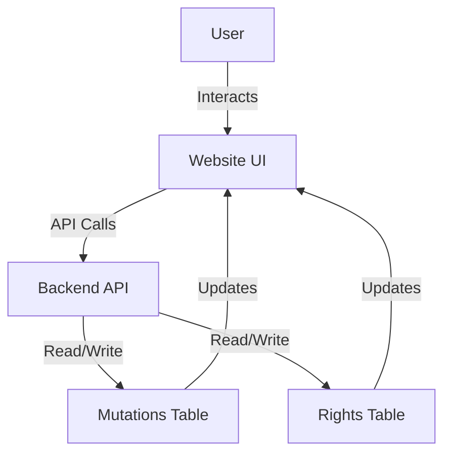

## Access Control Architecture

### Introduction & Scope
This document describes the architecture for the access control system, which manages user rights and tracks user actions (mutations) within various systems. The architecture covers both the backend database design and the frontend website requirements, ensuring secure and auditable management of user permissions.

The scope includes:
- Database schema for tracking user actions (mutations) and user rights (with validity periods)
- Website interface for viewing and managing mutations and rights
- Data flow between the website and the database

## Database Schema

The access control system relies on two primary tables:

### 1. Mutations Table
Tracks all user actions within the system for audit and traceability.

**Key Fields:**
- `mutation_id` (Primary Key)
- `user_id` (Foreign Key to Users table)
- `action` (e.g., grant_right, revoke_right, login, etc.)
- `system_id` (Foreign Key to Systems table)
- `timestamp` (DateTime of the action)
- `status` (e.g., approved, in_progress, rejected)
- `details` (Optional: JSON or text for additional info)

### 2. Rights Table
Stores which users have which rights in which systems, including the validity period.

**Key Fields:**
- `right_id` (Primary Key)
- `user_id` (Foreign Key to Users table)
- `system_id` (Foreign Key to Systems table)
- `right_type` (e.g., admin, read, write)
- `valid_from` (Start date of the right)
- `valid_to` (End date of the right, nullable for indefinite)

**Relationships:**
- Each mutation references a user and a system.
- Each right references a user and a system.
- Mutations may be linked to rights changes (e.g., a mutation that grants a right).

## Website Architecture

The website will be built using [Streamlit.io](https://streamlit.io), providing a user interface for managing and reviewing access control mutations and rights.

### Required Pages

1. **Approved Mutations Page**
   - Displays a list of all mutations that have been approved.
   - Allows filtering by user, system, date, and action type.
   - Provides details for each mutation (who, what, when, where).

2. **Mutations In Progress Page**
   - Shows all mutations that are currently in progress (pending approval or processing).
   - Allows filtering and searching similar to the approved mutations page.
   - Provides actions for authorized users to approve, reject, or review mutations.

Additional pages (optional, for future scope):
- User rights overview
- Audit logs
- System management

## Data Flow Overview

The website interacts with the backend database to display and manage access control data. The typical data flow is as follows:

1. **Fetching Data**
   - The website queries the database for mutations (filtered by status: approved or in progress) and rights.
   - Data is displayed in the relevant pages with filtering and search capabilities.

2. **User Actions**
   - When a user initiates an action (e.g., approve a mutation), the website sends a request to the backend.
   - The backend updates the relevant mutation status and, if applicable, updates the rights table.

3. **Audit and Traceability**
   - All changes are logged as new mutations, ensuring a complete audit trail.
   - Rights changes are always associated with a corresponding mutation record.

4. **Periodic Updates**
   - The website may use polling or websockets to refresh the list of in-progress mutations for real-time updates.

## Architecture Diagram

Below is a simplified diagram showing the main components and data flow:

This diagram illustrates how users interact with the website, which communicates with the backend API to read and update the database tables for mutations and rights.

## Conclusion

This architecture ensures robust access control, full auditability of user actions, and a clear separation between data storage, business logic, and user interface. The modular design allows for future expansion, such as additional reporting, more granular rights, or integration with external systems.
